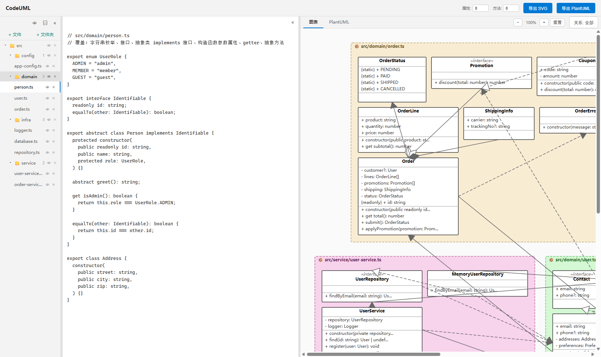

# CodeUML

**Generate UML class diagrams from TypeScript — in your browser, without uploading your code.**

[English](README.md) | [简体中文](README.zh-CN.md)

[](LICENSE)
[](#tech-stack)
[](#faq)



CodeUML reads real **TypeScript / TSX** source and draws a **UML class diagram** of it —
classes, interfaces, abstract classes, enums, generics, `{readonly}`/`{static}`/`{abstract}`
members and all six UML relation types. Drop in a folder (a whole **monorepo** is fine) and it
groups files into packages, resolves cross-package references with the TypeScript compiler's own
module resolution, and exports to **SVG** or **PlantUML**.

> Keywords: typescript uml · uml class diagram generator · typescript class diagram ·
> code to uml · typescript to plantuml · code visualization · monorepo ·
> ast parser · offline · self-hosted

## Why this exists

Existing options usually ask you to *describe* the diagram by hand:

| | CodeUML | Mermaid / PlantUML | IDE plugins |
|---|---|---|---|
| **Input** | your actual `.ts` / `.tsx` files | a diagram you write yourself | whatever the plugin supports |
| **Cross-file references** | ✅ resolved with the TypeScript compiler (imports, re-exports, `tsconfig` `paths`, workspace package names) | ❌ you wire it up manually | ⚠️ varies |
| **Where it runs** | in the browser; your code never leaves the page | browser / server / plugin | inside the IDE |
| **Export** | SVG, PlantUML | SVG / PNG / … | screenshots |

Typical uses: onboarding into an unfamiliar codebase, reviewing a PR's structural impact,
writing design docs, or checking that your packages don't depend on the wrong things.

## Quick start

```bash
git clone https://github.com/yanhuojiyusheng/CodeUML.git
cd CodeUML
npm install
npm start          # build + serve + open http://localhost:3000
```

Requires **Node.js 18+**. Change the port with `PORT=8080 npm start`; log every request with
`npm start -- --debug`.

## Features

- 🔄 **Live** — the diagram updates as you type (debounced, cached per file)
- 📊 **Classes, interfaces, abstract classes, enums** — plus generics (`Repository<T>`),
  `{static}` / `{abstract}` / `{readonly}` markers and class-level decorators as `«stereotype»`
- 🔗 **All six UML relations** — inheritance, implementation, association, aggregation,
  composition, dependency — with multiplicities
- 🗂️ **Folders & packages** — drop a folder (recursively read, `.ts` / `.tsx`), or create folders
  by hand; package name = folder path + file name
- 🌐 **Cross-package resolution** — `import` / `export *` barrels / renamed imports /
  `import * as NS` / `tsconfig` `paths` aliases / workspace package names from `package.json`
- 🧩 **Same class name in several packages** — nothing is dropped: both are drawn with a
  package-qualified title, references go to the right one, and anything genuinely ambiguous is
  reported (never silently guessed)
- 👁 **Visibility** — hide a file or a folder with the 👁 toggle to exclude it from the diagram,
  the PlantUML output
- 🔍 **Zoom & pan, highlighting, relation strength modes**
- 📥 **Export** to SVG and PlantUML
- ⚪ Light theme, **zero runtime dependencies**, works fully **offline**

## Usage

1. Paste TypeScript code into the left editor, or drop `.ts` / `.tsx` files / a folder onto it.
2. The UML class diagram appears on the right in real time.
3. Switch tabs: **Diagram / PlantUML** (the latter is generated on demand).

### File sidebar

- **Drop a folder** to load every `.ts` / `.tsx` file inside it, recursively.
  Relative paths become folders (package name = folder path + file name).
- **Skip rules**: directories named `dist` and `node_modules` are skipped entirely
  (not read, not shown). `package.json` and `tsconfig*.json` are read as *resolution metadata*
  only — they never show up as files in the diagram.
- **Folders**: create subfolders (select a folder, then `+ Folder`), rename by
  double-clicking, delete with `×` (removes everything inside).
- **Bulk loading** reads in chunks and parses once at the end, so a large folder appears
  progressively without re-parsing the whole project over and over.
- **Same name in different packages**: both classes are drawn, each title qualified by its
  package (e.g. `Config (src/api/config.ts)`). References are resolved with TypeScript's own
  module resolution, so `import { Config } from './config'` points at the right class. If there
  is no import to go by, the reference is connected to every candidate and the warning banner
  above the view tells you exactly which file and which candidates.
- The `⊟` button at the top collapses / expands all folders.
- **Visibility**: click the 👁 icon next to a file or folder to exclude it from parsing.
  Clicking a folder's 👁 writes the same state to all of its subfolders and files in one go;
  toggling a single file or folder stays independent and never updates its parent or the top
  button. The 👁 button in the top bar is a plain "hide all / show all" toggle.

### Diagram controls

| Action | How |
|--------|-----|
| Zoom | Ctrl/⌘ + wheel, or `−` / `+` / `Reset` |
| Pan | Hold the middle mouse button and drag |
| Highlight a class | Click it |
| Highlight a relation | Click near it, or double-click it to pin it |
| Relation strength | `Relations: All / Stronger / Strongest` |

## FAQ

**How do I generate a UML class diagram from a TypeScript project?**
Paste the code, or drop the folder (the repo root works best — then `package.json` /
`tsconfig.json` are picked up for cross-package resolution). No build step, no IDE plugin.

**Does my code get uploaded anywhere?**
No. Everything — the TypeScript compiler, the parser, the layout and the SVG renderer — runs in
your browser. The bundled `server.js` only serves static files.

**Can it handle a monorepo with several packages?**
Yes. Files become packages by folder path, `@scope/pkg` imports are resolved through the
`package.json` `name` fields you dropped in, and each `tsconfig.json`'s `paths` apply to the files
nearest to it.

**Two classes share a name — which one is drawn?**
Both. Each gets a package-qualified title (e.g. `Config (src/b.ts)`) and a unique PlantUML alias.
References are resolved by the file's own `import`s; when that can't decide, every candidate is
connected and the banner reports it with the source file and candidates.

**Does it support `.tsx` / JSX?**
Yes, `.tsx` / `.jsx` are parsed with the matching script kind. `.d.ts` files are read like any
other `.ts` file.

**Can I use it without running a server?**
Yes: `npm run build`, then open `index.html` directly. The TypeScript compiler is vendored into
`dist/typescript.min.js`, so no network access is needed.

**Can I export to PlantUML?**
Yes — exported from the toolbar as `.puml`, plus plain SVG. Mermaid is *not*
supported (Mermaid diagrams are written by hand; see the comparison above).

**Known limitations**
- Type aliases are resolved, not drawn as their own nodes. A union alias expands into
  dependencies to its members.
- Generic type parameters (`T`) never become relations, but type arguments in heritage do
  (`Repository<User>` → dependency on `User`).
- Layout is deterministic, not interactive: boxes can't be dragged around.

## Project Structure

```
CodeUML/
├── server.js               # Static file server (zero deps, opens the browser)
├── index.html              # Page shell (styles/app.css, dist/typescript.min.js, dist/bundle.js)
├── styles/
│   └── app.css             # Page styles
├── src/
│   ├── main.ts             # Entry: wires core capabilities to the UI and boots
│   │
│   ├── core/               # Pure logic (no DOM, independently testable)
│   │   ├── types.ts        # Core type definitions
│   │   ├── utils.ts        # Escaping / text width / geometry / path helpers
│   │   ├── members.ts      # Member selection (shared by layout and rendering)
│   │   ├── parser.ts       # Syntax pass: declarations, members, relations
│   │   ├── resolver.ts     # Semantic pass: TypeScript Program + module resolution
│   │   ├── merge.ts        # Multi-file merge: identity, endpoints, diagnostics
│   │   ├── layout.ts       # Layout engine
│   │   ├── relations.ts    # Relation strength and display modes
│   │   ├── svg.ts          # SVG renderer
│   │   └── plantuml.ts     # PlantUML text generator
│   │
│   └── ui/                 # DOM layer
│       ├── dom.ts          # Element lookup / HTML escaping
│       ├── samples.ts      # Default sample project
│       ├── highlight.ts    # Diagram highlighting + hit testing
│       ├── tabs.ts         # File tabs and folders
│       ├── panes.ts        # Split-pane resizing
│       ├── actions.ts      # Export actions
│       ├── scheduler.ts    # Debounced / suspendable update scheduling
│       ├── warnings.ts     # Diagnostics banner
│       └── zoom.ts         # Zoom & pan
│
├── tests/                  # Jest tests (unit + PlantUML validator)
└── dist/                   # Build output (bundle.js + vendored typescript.min.js)
```

### Core modules

| Module | Responsibility |
|--------|----------------|
| `core/parser.ts` | Syntax pass: extracts classes / interfaces / enums / members / relations |
| `core/resolver.ts` | Semantic pass: resolves each type name to the package that declares it, via an in-memory TypeScript `Program` |
| `core/merge.ts` | Multi-file merge: unique class identity per package, endpoint resolution, diagnostics |
| `core/layout.ts` | Places classes and picks a near-square arrangement of packages |
| `core/svg.ts` | Renders the layout to SVG (boxes and relation arrows) |
| `core/plantuml.ts` | Generates PlantUML text |
| `core/members.ts` | Member selection rules (shared by layout height and rendering) |
| `ui/*` | DOM events, file sidebar, split panes, exports |
| `main.ts` | Wiring and boot |

### Development commands

```bash
npm run dev            # rebuild on change
npm run build          # bundle to dist/bundle.js + vendor the TypeScript compiler
npm test               # run tests (no coverage by default)
npm run test:coverage  # run tests with a coverage report
npm run typecheck      # type check
node server.js --check # server self-check
```

## Supported UML Relations

| Relation | Detected from | Arrow |
|----------|---------------|-------|
| Inheritance | `extends` | solid line + hollow triangle ▷ |
| Implementation | `implements` | dashed line + hollow triangle ▷ |
| Association | a plain property reference | solid line + filled triangle ▶ |
| Aggregation | an array / collection property (`T[]`, `Array<T>`, `Set<T>`, …) | solid line + hollow diamond ◇ |
| Composition | a property initialized with `new` | solid line + filled diamond ◆ |
| Dependency | a method parameter / return type / `new` inside a method body | dashed line + open arrow → |

Multiplicity: `*` for arrays/collections, `0..1` for optional or nullable types, `1` otherwise.
When an alias expands into a union (`type Entry = A | B`), the members become *dependencies*
rather than ownership — an alias is not a box on the diagram.

## Supported Languages

- TypeScript / JavaScript (current)
- More languages planned

## Tech Stack

- **TypeScript Compiler API** — syntax parsing + semantic symbol resolution
- **SVG** — diagram rendering
- **esbuild** — bundling
- **Node built-in `http`** — static file server (no runtime dependencies)
- **Jest** — tests
- Pure frontend, no backend services

## License

MIT
